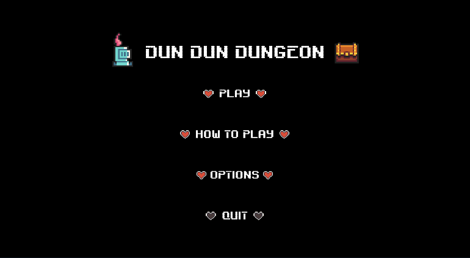
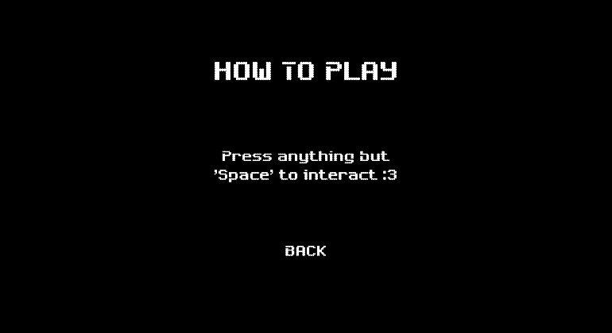
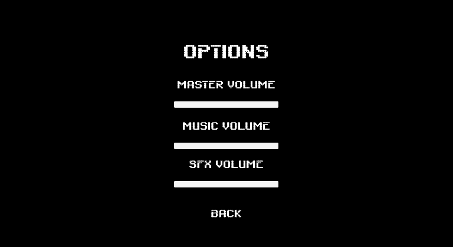
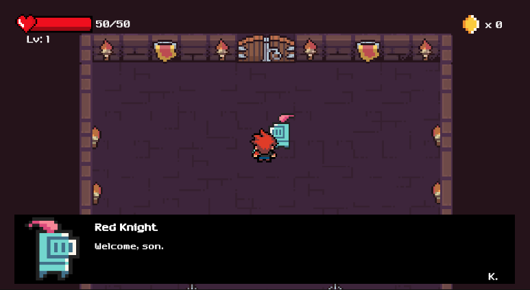
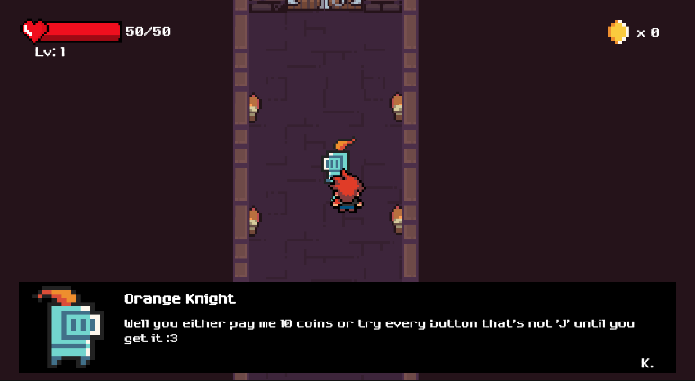
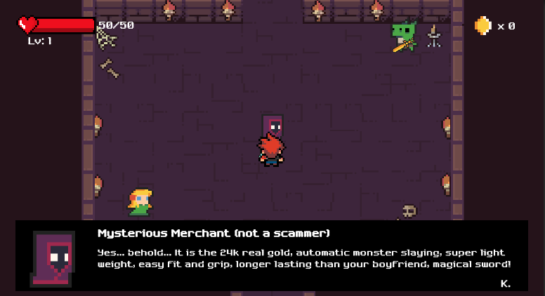
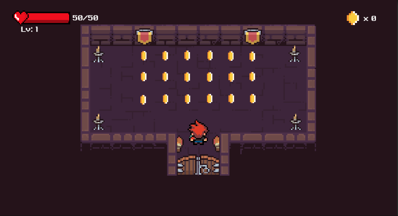
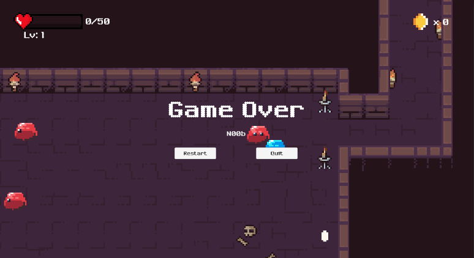

# DunDunDungeon
2D Top down RPG game.  
Classic 16 bit pixel graphics packed with lots of cute bit musics to enjoy.  
Enjoy interacting with unique NPCs, slaying monsters, leveling up, discovering secret rooms, and collecting coins.  

Link to portfolio: https://celine-zhou-game-dev-porfolio.web.app/  
(Demo video and description available in portfolio)

## Installation instructions
1. Download the Setup file. (NOTE: windows setup only)
2. Open up the file and follow the download instructions.
3. Enjoy :3

## Scripts
All C# scripts written for the game is included in the scripts folder

## Note
- Try interacting with every NPC you find

## Gallery
### Start Menu

### Interacting with NPCs

  

### Combat

### Discover secret rooms

### There is always a second chance, or third, or fourth...

